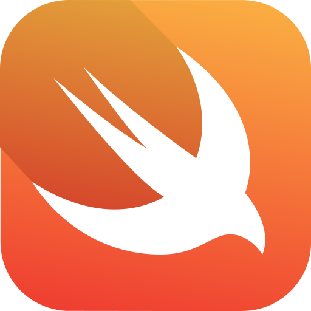

### What's up <i>< Coders /></i>! 👋
Welcome to my Profile! I'm Felipe from Brazil, I'm a guy that is always try to learn something new  
and put in practice what I learned.

<h2>Hi I'm Felipe Araujo! </h2>

<b>Things to know about me!</b> 

  

## 💫Technologies

Front End: <strong>HTML, CSS, JAVASCRIPT, PYTHON,</strong>  
Back End: <strong>NONE</strong>

## Some knowledge in technologies

