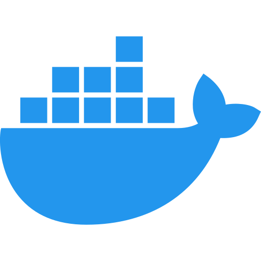

# Hi, I'm Felipe Araujo 👋

## About Me

I'm a passionate mobile software developer with expertise in a variety of technologies. My primary focus is on building amazing mobile applications using Swift, Dart, Flutter, and Java for Android. I'm also skilled in backend development with Node.js and NestJS. I enjoy containerization with Docker and have experience in web development with Angular and the Ionic Framework. I'm always eager to learn and explore new tools and frameworks to create exceptional user experiences.

## GitHub Stats

## Most Used Languages

  

## Technologies I Work With

  
  
  
  
  
  
  
  

## GitHub Activity

  
  
  

Feel free to explore my repositories and get in touch if you have any questions or would like to collaborate on a project. Let's build great software together! 🚀
